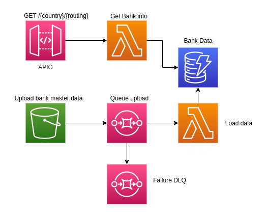

Microservice to validate bank routing numbers.

Automated lambda to download and update routing number database monthly.

## TODO List
- [x] refactor project file locations
- [x] convert to typescript
- [ ] move database access functions to separate file
- [x] update database schema
- [ ] add rate limiting
- [ ] add custom authorizer with dynamodb clients
